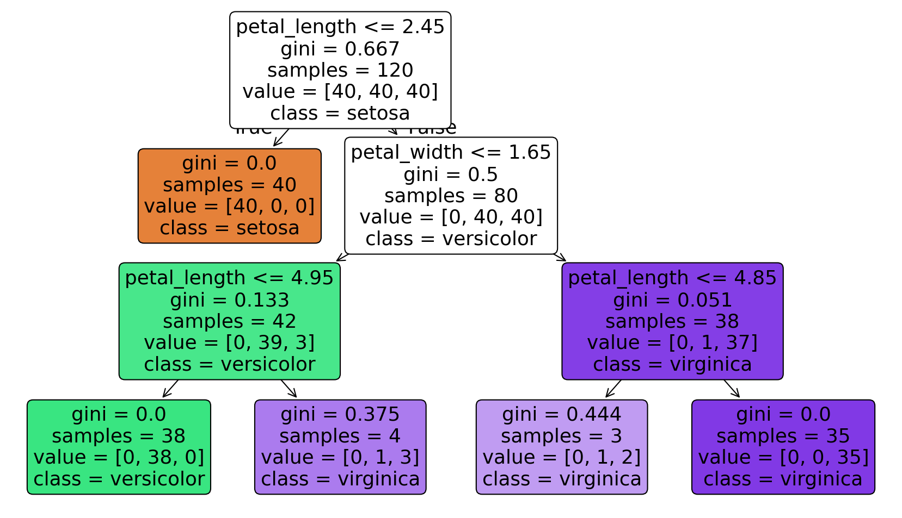

# Task 2: Decision Tree Classification

## Objective

The objective of this task is to build a Decision Tree classifier capable of predicting categorical outcomes using supervised machine learning and evaluate its performance using classification metrics.

## Dataset

- **Dataset:** Iris Dataset
- **Problem Type:** Multi-Class Classification
- **Target Variable:** Species

## Tools & Libraries

- Python
- Google Colab
- pandas
- NumPy
- scikit-learn
- matplotlib

## Methodology

- Loaded the Iris dataset.
- Performed basic preprocessing.
- Split the dataset into training and testing sets.
- Trained a Decision Tree classifier.
- Visualized the Decision Tree structure.
- Applied pruning techniques to reduce overfitting.
- Evaluated the classifier using standard performance metrics.

## Evaluation Metrics

The model was evaluated using:

- Accuracy
- Precision
- Recall
- F1-Score
- Confusion Matrix

## Decision Tree Visualization

The figure below shows the trained Decision Tree used for classification.

## Outcome

A Decision Tree classifier was successfully developed for multi-class classification. The trained model was visualized and evaluated using multiple performance metrics to assess its classification capability.

## Files

- `Decision_Tree.ipynb`
- `README.md`
